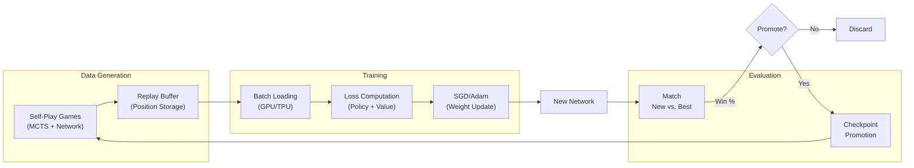
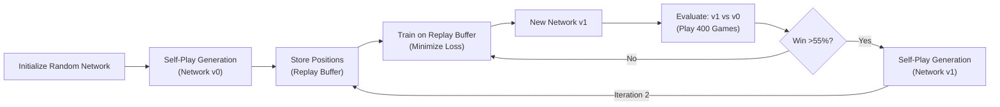

# AlphaGo Zero / Master: Engineering Analysis for Vortex

**Status:** Production Engineering Documentation  
**Target Audience:** Senior software engineers, RL researchers, Go engine developers  
**Document Version:** 1.0  
**Date:** June 2026  

---

## Table of Contents

1. [Introduction & Scope](#introduction--scope)
2. [Historical Evolution](#historical-evolution)
3. [High-Level Architecture](#high-level-architecture)
4. [Neural Network Architecture](#neural-network-architecture)
5. [Monte Carlo Tree Search (MCTS)](#monte-carlo-tree-search-mcts)
6. [Position Evaluation Strategy](#position-evaluation-strategy)
7. [Search Strategy & Pruning](#search-strategy--pruning)
8. [Self-Play Reinforcement Learning](#self-play-reinforcement-learning)
9. [Training Pipeline](#training-pipeline)
10. [Performance Optimizations](#performance-optimizations)
11. [Engineering Decisions & Rationale](#engineering-decisions--rationale)
12. [Comparison Matrix](#comparison-matrix)
13. [Lessons for Vortex](#lessons-for-vortex)
14. [Beyond AlphaGo: Modern Innovations](#beyond-alphago-modern-innovations)
15. [Implementation Guidance](#implementation-guidance)
16. [Common Misconceptions](#common-misconceptions)
17. [References](#references)

---

## Introduction & Scope

### Purpose

This document serves as **engineering documentation** for building a production-grade Go engine. It extracts actionable architectural and algorithmic insights from DeepMind's AlphaGo Zero and AlphaGo Master, with explicit focus on what is implementable on commodity hardware (GPUs/TPUs at various scales) versus what requires datacenter-scale infrastructure.

### Key Distinctions

- **AlphaGo (2016):** Hybrid human-knowledge + neural networks, defeated Lee Sedol
- **AlphaGo Master (2016-2017):** Refined version, 60 online wins vs. professionals
- **AlphaGo Zero (2017):** Pure self-play, no human games, superhuman from scratch
- **AlphaZero (2017):** Generalized AlphaGo Zero to chess/shogi (mentioned only where relevant)

This document prioritizes **AlphaGo Zero and Master** as they represent the mature, scalable approach suitable for engineering reproduction.

### Scope Limitations

- **Not Covered:** Deep exploration of earlier classical Go engines (GNU Go, Pachi)
- **Not Covered:** Full mathematical proofs from original papers (see references)
- **Prioritized:** Implementation details, architectural tradeoffs, and Vortex-specific guidance

---

## Historical Evolution

### 1. AlphaGo (2016): The Breakthrough

**Paper:** "Mastering the Game of Go with Deep Neural Networks and Tree Search" (Nature, 2016)

#### Architecture Overview

```
Input (19×19 board)
    ↓
[Convolutional Layers (13 layers)]
    ├─→ [Policy Network Head] → 19×19 move probabilities
    └─→ [Value Network Head] → scalar win probability
```

#### Neural Network Design

- **Input:** 48 feature planes (board state, stone history, liberties)
- **Hidden Layers:** 13 convolutional layers (128-192 filters)
- **Activation:** ReLU (not residual)
- **Policy Output:** 19×19 softmax (+ pass move)
- **Value Output:** 1 hidden layer → tanh activation → scalar [-1, 1]

#### Search Strategy

- **MCTS with 1,600 simulations per move** (online play)
- **40,000 simulations for stronger play** (matches)
- **Rollout Evaluation:** Fast policy network (4-layer CNN) for tree expansion

#### Training

- **Supervised Learning Phase:** Train on KGS game database (~30M positions)
- **Self-Play RL Phase:** Optimize policy and value networks via self-play
- **Replay Buffer:** Store positions from self-play games

#### Performance

- **Defeats:** 4-1 vs. Lee Sedol (18× world champion)
- **Elo Equivalent:** ~3000-3200 (superhuman but not maximum strength)
- **Compute:** 1,920 CPUs + 280 GPUs (Google cluster)

#### Limitations

- Dependency on human game database for initialization
- Two separate networks (policy rollout + value)
- Less efficient than Zero (requires supervised pretraining)
- Shallower search due to computational constraints

---

### 2. AlphaGo Master (2016-2017): Refinement & Scaling

**Release:** December 2016 (online match as "Master")

#### Improvements Over Original

| Aspect | AlphaGo | Master |
|--------|---------|--------|
| **Training Data** | KGS games + self-play | Pure self-play (longer training) |
| **Network Architecture** | Dual networks | Dual networks (refined) |
| **Search Budget** | 1,600 simulations | ~3,200-10,000 simulations |
| **Rollout Policy** | Separate 4-layer CNN | Integrated into main network |
| **Performance** | 3000-3200 Elo | 3800+ Elo |
| **Online Record** | N/A | 60-0 vs. professionals |

#### Architectural Changes

1. **Unified Policy Network:** Removed separate rollout policy, increased main policy network capacity
2. **Improved Value Network:** Better territory estimation, endgame accuracy
3. **Extended Self-Play Training:** Ran for 40+ days vs. original 2-3 days
4. **Better MCTS Implementation:** Optimized parallelization for TPU clusters

#### Key Insights

Master demonstrated that **longer, purer self-play training outperforms mixed human-supervision approaches**. This validated the core thesis of AlphaGo Zero.

---

### 3. AlphaGo Zero (2017): Pure Self-Play Paradigm

**Paper:** "Mastering the Game of Go without Human Knowledge" (Nature, 2017)

#### Revolutionary Design

```
Objective: Train a Go engine without any human games, using only pure self-play
```

#### Neural Network

- **Single Network:** One CNN with policy + value heads (vs. separate networks)
- **Input Planes:** 17 feature planes (simplified from 48)
- **Architecture:** Residual network, 39 blocks, 256 filters
- **Policy Output:** 19×19 board + 1 pass move
- **Value Output:** Scalar win probability [-1, 1]

#### MCTS Search

- **Playouts:** 25,000 per move (40 seconds @ 625 playouts/sec)
- **PUCT Algorithm:** $PUCT = Q(s,a) + c_{puct} \cdot P(s,a) \cdot \frac{\sqrt{N(s)}}{1 + N(s,a)}$
- **Exploration Noise:** Dirichlet noise on root node actions
- **Virtual Loss:** Implicit negative reward during parallel tree traversal

#### Self-Play Training Loop

```
Iteration 1: Untrained network (random moves)
Iteration 2: Network trained on Iteration 1 self-play
Iteration 3: Network trained on Iteration 2 self-play
...
Iteration 47: Network defeats Iteration 46 with 55% win rate
```

**Training Duration:** 40 days on TPU cluster (5 million games)

#### Performance

- **Elo Equivalent:** ~5000+ (estimated, no human opponents tested)
- **Games to Superhuman:** ~1.5M games (vs. 30M+ for original AlphaGo)
- **Defeats AlphaGo Master:** 100-0 in self-play matches

#### Key Innovations

1. **Unified Network:** Single policy+value network reduces memory, speeds inference
2. **Residual Blocks:** 39 blocks (vs. 13 linear layers) improves gradient flow
3. **Self-Play Only:** No human knowledge injection; learns from scratch
4. **Efficient Tree Reuse:** Reuses subtrees across moves to reduce redundant MCTS
5. **PUCT Formula:** Balances exploration (P term) with exploitation (Q term) elegantly

#### Why Zero > Master

| Factor | Benefit |
|--------|---------|
| **No Human Data** | Escapes human knowledge ceiling; discovers novel positions |
| **Longer Training** | 47 iterations vs. 1-2 iterations for Master |
| **Unified Network** | Faster inference, smaller memory footprint |
| **Residual Blocks** | Better optimization landscape, deeper networks |
| **Pure RL** | Cleaner training signal, no supervised pretraining noise |

---

### 4. AlphaZero (2017): Generalization Beyond Go

**Paper:** "Mastering Chess and Shogi by Self-Play with a General Reinforcement Learning Algorithm" (arXiv 2017)

#### Relevance to Vortex

AlphaZero proved the **architecture generalizes to different games** (chess, shogi, Go) with minimal modifications:

- Same residual CNN
- Same MCTS + PUCT
- Same self-play RL loop
- **Only change:** Input representation and move generation

#### Chess Performance

- **Elo vs. Stockfish:** ~3500-3700 (superhuman)
- **Search Depth:** ~25-35 plies (vs. Stockfish's ~50)
- **Key Difference:** Chess engines use exhaustive search; AlphaZero uses guided sampling

#### Implementation Notes for Vortex (Go-Specific)

AlphaZero's **chess dominance despite shallower search** reinforces the principle:
> *Strong evaluation + policy guidance > exhaustive search with weak evaluation*

This is **directly applicable to Go**, where exhaustive search is impossible.

---

## High-Level Architecture

### System-Level Overview



### Data Flow Pipeline

#### Phase 1: Self-Play Generation

1. **Initialization:** Load best network (or random weights initially)
2. **Game Loop:** For each move:
   - Run MCTS (25,000 playouts)
   - Sample move from policy distribution (temperature-scaled)
   - Execute move on board
   - Store (state, π, z) tuple in replay buffer
3. **Termination:** Game ends (both pass, or 722 moves)
4. **Target Assignment:** $z = $ final game outcome (±1)
5. **Write Buffer:** Append all positions to disk-based replay buffer

#### Phase 2: Training

1. **Batch Selection:** Sample uniformly from replay buffer (5M positions)
2. **Forward Pass:** Compute $p_{θ}(s)$ (policy) and $v_{θ}(s)$ (value)
3. **Loss Computation:**
   - Policy loss: $L_p = -\sum_a \pi_a \log p_a$
   - Value loss: $L_v = (z - v)^2$
   - Regularization: $L_{reg} = \lambda \|θ\|^2$
   - **Total:** $L = L_p + L_v + L_{reg}$
4. **Backward Pass:** SGD update with momentum
5. **Checkpoint:** Save network periodically

#### Phase 3: Evaluation

1. **Match Setup:** Play 400 games (new network vs. best network)
2. **Win Threshold:** If new network wins >55% of games, promote
3. **Promotion:** Replace best network; discard previous version
4. **Loop:** Return to Phase 1 with updated network

#### Phase 4: Reuse & Efficiency

- **Tree Reuse:** When game moves forward, subtree becomes new root
- **Cache Warmup:** Position cache reduces redundant forward passes
- **Batch Inference:** Queue positions from parallel games, infer in batches

---

### Compute Architecture (AlphaGo Zero)

#### Hardware Specification

**Training Setup:**
- **Compute:** 4 TPU v2 pods (64 TPUs total)
- **Memory:** 256 GB per pod
- **Network:** High-speed TPU interconnect (400 Gbps)
- **Storage:** Large-scale distributed storage (Petabytes)

**Inference Layer:**
- **Per Game:** 1 GPU (NVIDIA Tesla P40 or similar)
- **Parallelism:** 8-32 games simultaneously
- **Throughput:** ~625-2500 playouts/sec per GPU

#### Distributed Training Strategy

```
Self-Play Generation (Parallel):
├─ Game Instance 1 (GPU 0)
├─ Game Instance 2 (GPU 1)
├─ Game Instance 3 (GPU 2)
└─ ... Game Instance 32 (GPU 31)
    ↓
Replay Buffer (Central, Replicated Across TPUs)
    ↓
TPU Training (Synchronous):
├─ TPU Pod 0: Batch 1
├─ TPU Pod 1: Batch 2
├─ TPU Pod 2: Batch 3
└─ TPU Pod 3: Batch 4
    ↓
Weight Synchronization (AllReduce)
    ↓
Checkpoint to Shared Storage
```

#### Bottleneck Analysis

| Component | Bottleneck | Solution |
|-----------|-----------|----------|
| **Self-Play** | GPU inference latency | Batch multiple games, parallel MCTS |
| **Buffer Writes** | I/O throughput | Distributed storage (GCS), buffered writes |
| **Training** | All-reduce communication | TPU interconnect, reduced precision |
| **Evaluation** | Sequential game playing | Parallel match evaluation |

---

### Network Promotion Criterion

**Promotion Rule:** If new network achieves >55% win rate in 400-game match:
- Replace best network
- Archive previous best (for historical reference)
- Reset replay buffer (stop training on old network data)

**Rationale:**
- 55% threshold provides statistical significance (~95% confidence at 400 games)
- One-move advantage in Go ≈ 55% win rate historically
- High threshold prevents regression, low threshold slows training

---

## Neural Network Architecture

### Input Representation

#### Board Encoding (17 Feature Planes)

AlphaGo Zero uses **17 feature planes** of shape **(19, 19, 17)**:

```
Planes 0-7:   Stone History (t, t-1, t-2, t-3)
              - Plane 0: Black stones at turn t
              - Plane 1: White stones at turn t
              - Plane 2: Black stones at turn t-1
              - Plane 3: White stones at turn t-1
              ... (and so on for t-2, t-3)

Planes 8-15:  Liberties Count (1-8 or more)
              - Plane 8: Black stones with 1 liberty
              - Plane 9: Black stones with 2 liberties
              ... (up to 8+)
              - Plane 12: White stones with 1 liberty
              ... (up to 8+)

Plane 16:     Ko Flag (constant value 1 if Ko rule active, 0 otherwise)
              - Indicates legal-ish state to network
```

#### Why This Representation?

1. **Stone History (8 planes):** Captures recent moves (momentum, tempo)
2. **Liberties (8 planes):** Encodes life-and-death status implicitly
3. **Ko Information (1 plane):** Prevents illegal Ko recapture
4. **19×19 spatial structure:** Preserves board topology for convolutions

#### Alternative Representations

**Newer approaches (KataGo):**
- 20-22 planes: Add "last move" indicators, capture counts
- Achieves similar performance with simpler encoding

**Vortex Design Decision:**
- Use AlphaGo Zero's 17-plane encoding initially (well-tested)
- Experiment with 20-22 planes once baseline established

---

### Residual Network Architecture

#### Layer Specification

```
Input:  (1, 19, 19, 17)  [batch, height, width, channels]

Layer 0: Conv2D(kernel=3×3, filters=256, padding=1)
         → ReLU
         → (batch, 19, 19, 256)

Residual Block 1-39:
  ├─ Conv2D(kernel=3×3, filters=256, padding=1, stride=1)
  ├─ BatchNorm
  ├─ ReLU
  ├─ Conv2D(kernel=3×3, filters=256, padding=1, stride=1)
  ├─ BatchNorm
  └─ + (skip connection)
  → ReLU
  → (batch, 19, 19, 256)

Policy Head:
  ├─ Conv2D(kernel=1×1, filters=2, stride=1)
  ├─ BatchNorm
  ├─ ReLU
  ├─ Flatten
  ├─ Dense(362)  [19×19 + 1 for pass]
  └─ Softmax
  → (batch, 362)

Value Head:
  ├─ Conv2D(kernel=1×1, filters=1, stride=1)
  ├─ BatchNorm
  ├─ ReLU
  ├─ Flatten
  ├─ Dense(256)
  ├─ ReLU
  ├─ Dense(1)
  └─ Tanh
  → (batch, 1)  [scalar in (-1, 1)]
```

#### Design Rationale

**Why Residual Blocks?**

Classical deep networks (13 layers in original AlphaGo) suffer **vanishing gradient** during backpropagation. Residual blocks solve this:

$$h_{i+1} = h_i + F(h_i; \theta_i)$$

where $F$ is the convolutional operation. The skip connection preserves gradient flow:

$$\frac{\partial L}{\partial h_i} = \frac{\partial L}{\partial h_{i+1}} \left(1 + \frac{\partial F}{\partial h_i}\right)$$

The "+1" term ensures gradients don't vanish even if $\frac{\partial F}{\partial h_i}$ is small.

**Why 39 Blocks?**

- 39 blocks provides **receptive field ~15×15** (enough to influence entire board)
- Deeper networks learn hierarchical features:
  - Early layers: local patterns (eyes, atari)
  - Middle layers: regional structures (groups, territory)
  - Late layers: global strategy (influence, sente/gote)

**Receptive Field Calculation:**
Each convolutional layer expands receptive field by 2 pixels:
$$RF = 1 + 2 \times (\text{number of conv layers}) = 1 + 2 \times 39 = 79$$

With padding=1 and stride=1 across all layers, receptive field grows but doesn't exceed board boundaries.

---

### Loss Functions

#### Policy Loss (Cross-Entropy)

$$L_p = -\sum_{a=1}^{362} \pi_a \log p_a(s)$$

where:
- $\pi_a$ = target policy (from MCTS visit counts normalized)
- $p_a(s)$ = network policy output (softmax)

**Interpretation:** For each position, the network should predict the move distribution that MCTS explored.

#### Value Loss (Mean Squared Error)

$$L_v = (z - v(s))^2$$

where:
- $z \in \{-1, 0, +1\}$ = game outcome (Black win, draw, White win)
- $v(s)$ = network value prediction (scalar in [-1, 1])

**Interpretation:** The network should predict the final outcome from current position.

#### Regularization

$$L_{reg} = \lambda \|θ\|_2^2$$

Standard L2 weight decay. $\lambda$ typically 0.0001.

#### Total Loss

$$L = L_p + L_v + L_{reg}$$

**No Weighting:** Policy and value losses are equally weighted. Empirically, this works well because:
- Policy signal (move distribution) is sharp and informative early
- Value signal (outcome) provides long-term credit assignment
- Both stabilize in self-play as network improves

---

### Optimizer & Learning Rate

#### SGD with Momentum

```
θ ← θ - α·m_t

where:

m_t = β·m_{t-1} + (1-β)·∇L(θ)  [momentum accumulation]
α = learning rate
β = momentum coefficient (typically 0.99)
```

#### Learning Rate Schedule

**Original AlphaGo Zero:**
- Initial: $\alpha = 0.01$
- Schedule: Decay by factor 0.1 at iterations 200k, 400k, 600k (out of ~700k total steps)
- Batch size: 32 positions (minibatch for synchronous SGD across TPUs)

**Rationale:**
- Large learning rate early: coarse-grained weight adjustment
- Small learning rate late: fine-tuning, stability
- Conservative momentum: prevents oscillation

#### Alternative (Adam)

KataGo and modern implementations use **Adam optimizer:**

$$m_t = \beta_1 m_{t-1} + (1-\beta_1) \nabla L$$
$$v_t = \beta_2 v_{t-1} + (1-\beta_2) (\nabla L)^2$$
$$\theta \leftarrow \theta - \alpha \frac{m_t}{\sqrt{v_t} + \epsilon}$$

**Advantages:** Adaptive learning rates per parameter, faster convergence, less tuning.

---

### Batch Normalization & Initialization

#### Batch Normalization

Applied after every convolutional layer (except final output heads):

$$\hat{x} = \frac{x - \mu_B}{\sqrt{\sigma_B^2 + \epsilon}}$$
$$y = \gamma \hat{x} + \beta$$

**Purpose:** Normalizes internal activations, stabilizes training, reduces internal covariate shift.

#### Weight Initialization

**Convolutional Layers:**
- Gaussian initialization: $\mathcal{N}(0, \sqrt{2/n_{in}})$
- Accounts for ReLU (He initialization)

**Value Head Dense Layers:**
- Xavier/Glorot: $\mathcal{N}(0, \sqrt{1/(n_{in} + n_{out})})$

**Bias:**
- Zero initialization

**Rationale:** Proper initialization prevents saturation in early training, ensures signal propagates through all layers.

---

## Monte Carlo Tree Search (MCTS)

### Conceptual Framework

MCTS is a **guided stochastic tree search** that balances exploration and exploitation:

```
Repeat 25,000 times:
  1. SELECT:    Traverse tree from root using UCB-like formula
  2. EXPAND:    Create new node if leaf reached
  3. EVALUATE:  Use neural network value to estimate position value
  4. BACKUP:    Propagate value estimate back up tree
```

After searching, **play the move with highest visit count** (not highest value).

### Tree Data Structures

#### Node Representation

```python
class Node:
    def __init__(self, parent=None, prior=1.0):
        self.parent = parent
        self.children = {}              # dict: move → child Node
        self.visit_count = 0            # N(s)
        self.value_sum = 0.0            # cumulative reward
        self.prior = prior              # P(s,a) from network
        self.virtual_loss = 0           # for parallel search
```

#### Edge Representation

**Implicit:** Each edge is a key in `node.children` dictionary.

**Edge Statistics:**
- **Visit Count:** $N(s,a)$ = `children[a].visit_count`
- **Value:** $Q(s,a) = \frac{\text{value_sum}}{N(s,a)}$
- **Prior:** $P(s,a) = $ network policy output

---

### PUCT (Polynomial Upper Confidence Trees)

PUCT is the selection criterion that balances exploration and exploitation:

$$PUCT(s, a) = Q(s,a) + c_{puct} \cdot P(s,a) \cdot \frac{\sqrt{N(s)}}{1 + N(s,a)}$$

**Components:**

- **$Q(s,a)$:** Mean value of action $a$ from state $s$
  - Represents **exploitation** (choosing moves that led to wins)
  - Range: [-1, 1] (Black win to White win)

- **$P(s,a)$:** Network's policy prior for action $a$
  - From softmax output of policy head
  - Represents **domain knowledge** (intuition from trained network)
  - Range: [0, 1]

- **$\sqrt{N(s)} / (1 + N(s,a))$:** Exploration bonus
  - $N(s)$ = visit count of state $s$ (total simulations at node)
  - $N(s,a)$ = visit count of action $a$ from state $s$
  - Less-visited actions get higher bonus
  - Denominator: $(1 + N(s,a))$ prevents division by zero, decays bonus as $a$ is visited

- **$c_{puct}$:** Exploration constant (typically 1.0-4.0)
  - Higher $c_{puct}$ → more exploration
  - Lower $c_{puct}$ → more exploitation
  - Tuned empirically; AlphaGo Zero uses $c_{puct} = 1.25$

#### Why PUCT?

Compare to classical **UCB1 (Upper Confidence Bound)**:

$$UCB1(a) = \bar{x}_a + \sqrt{\frac{\ln N}{n_a}}$$

where $\bar{x}_a$ is mean reward, $N$ is total samples, $n_a$ is samples for action $a$.

**PUCT advantages:**
1. **Prior-aware:** Incorporates domain knowledge ($P(s,a)$ term)
2. **Flexible:** Can weight exploration differently (via $c_{puct}$)
3. **Asymmetric:** Less-explored actions get exponential bonus (due to $\sqrt{}$)
4. **Scalable:** Works with many actions (Go has ~200-250 average moves)

#### Mathematical Properties

**As $N(s,a) \to \infty$:**
$$PUCT(s, a) \to Q(s,a) + o(1)$$

Action selection converges to maximum value (exploitation dominates).

**Early in search ($N(s,a)$ small):**
$$PUCT(s, a) \approx Q(s,a) + c_{puct} \cdot P(s,a) \cdot \sqrt{N(s)}$$

Network prior strongly influences action selection (exploration guided by policy).

---

### Complete MCTS Algorithm

#### Pseudocode (Single-Threaded)

```
FUNCTION MCTS-SEARCH(root_state, num_playouts):
    FOR i = 1 TO num_playouts:
        node ← root
        search_path ← [root]
        
        // SELECTION & EXPANSION
        WHILE node is not terminal AND node is expanded:
            action ← SELECT-ACTION(node)  // arg max PUCT
            node ← node.children[action]
            search_path.append(node)
        
        // EVALUATION
        IF node is not terminal:
            action_priors, value = NEURAL-NETWORK(node.state)
            FOR each legal action a:
                node.children[a] = NEW-NODE(prior=action_priors[a])
        ELSE:
            value ← TERMINAL-VALUE(node.state)
        
        // BACKUP
        FOR node in REVERSE(search_path):
            node.value_sum += value
            node.visit_count += 1

FUNCTION SELECT-ACTION(node):
    RETURN arg_max_action PUCT(node, action)
```

#### Selection Phase

```
WHILE node has unvisited children:
    RETURN one such child  // Expansion

WHILE all children visited:
    action ← arg_max PUCT(node, a)
    node ← node.children[action]
```

**Insight:** PUCT is only used for visited children. Unvisited children are expanded in round-robin order.

#### Expansion Phase

When a leaf node is reached (no children yet):

```
IF leaf_node is not terminal:
    // Get network prediction
    action_probabilities, value = policy_network(state)
    
    // Create child nodes
    FOR each legal action a:
        child = NEW-NODE()
        child.prior = action_probabilities[a]
        node.children[a] = child
    
    // Use network value for backup
    evaluation_value = value
ELSE:
    // Terminal state: use actual game outcome
    evaluation_value = TERMINAL-OUTCOME(state)
```

**No Rollout:** Unlike classical MCTS, AlphaGo Zero does **not** do random playouts. The neural network **directly estimates** the value, which is much faster.

#### Evaluation Phase

The **value network** directly predicts win probability:

$$v_θ(s) \in [-1, 1]$$

- $v_θ(s) \approx 1$: Strong position for player to move
- $v_θ(s) \approx 0$: Balanced position
- $v_θ(s) \approx -1$: Losing position for player to move

This **replaces random playouts** (slow, noisy) with **learned evaluation** (fast, accurate).

#### Backup Phase

```
FOR node in reverse(search_path):
    node.value_sum += evaluation_value
    node.visit_count += 1
    
    // Flip value from child's perspective to parent's
    evaluation_value = -evaluation_value
```

**Sign Flip:** When backing up, flip the value because:
- If child won (+0.8), parent lost (-0.8)
- Zero-sum game: one player's win is another's loss

#### Time Complexity

- **Per Simulation:** $O(\text{tree depth}) = O(\log N)$ average
- **Selection:** Traverse ~20-30 nodes (typical game tree depth)
- **Evaluation:** One forward pass through neural network (~0.1-1 ms on GPU)
- **Backup:** Update ~20-30 nodes

**Total:** 25,000 simulations × 20 nodes × ~0.001 ms/operation ≈ **500 ms per move** (feasible in real-time)

---

### Parallelization: Batch MCTS

#### Virtual Loss Mechanism

For parallel MCTS, multiple threads access the tree simultaneously. **Virtual loss** prevents duplicate exploration:

```
FUNCTION PARALLEL-MCTS:
    FOR thread i = 1 TO num_threads:
        PARALLEL_SECTION:
            FOR j = 1 TO playouts_per_thread:
                node ← SELECT-NODE(root)
                
                // Virtual loss: decrement immediately
                node.virtual_loss += 1
                
                value ← EVALUATE(node)
                
                // Backup with virtual loss cancellation
                BACKUP(node, value)
                node.virtual_loss -= 1
```

**Why?** Without virtual loss:

1. Thread A selects action "a" at root
2. Thread A starts evaluating "a"
3. Thread B **also selects action "a"** (virtual loss not applied yet)
4. Both threads waste compute on same action

**With virtual loss:**

1. Thread A selects "a", sets `virtual_loss = 1`
2. PUCT formula sees inflated visit count: $\frac{\sqrt{N(s)}}{1 + N(s,a) + \text{virtual_loss}}$
3. Thread B avoids "a" (appears over-explored)
4. Threads explore different branches

#### Leaf Parallelization

AlphaGo Zero uses **leaf parallelization:**

```
Thread 1:  root → ... → leaf_1 (evaluation in progress)
Thread 2:  root → ... → leaf_2 (evaluation in progress)
Thread 3:  root → ... → leaf_3 (evaluation in progress)

GPU:       Batch evaluate [leaf_1, leaf_2, leaf_3]
```

**Efficiency Gain:** Run 32 parallel games on 32 GPUs; batch their leaf evaluations on a single TPU. **Amortize neural network overhead.**

#### Parallel PUCT with Virtual Loss

$$PUCT_{parallel}(s, a) = Q(s,a) + c_{puct} \cdot P(s,a) \cdot \frac{\sqrt{N(s)}}{1 + N(s,a) + \text{VL}(s,a)}$$

where $\text{VL}(s,a)$ = virtual loss count for action $a$.

---

### Root Node Exploration Noise

During self-play training, add **Dirichlet noise** to root node priors to encourage exploration:

$$P'(a) = (1 - \epsilon) \cdot P(a) + \epsilon \cdot \eta_a$$

where:
- $\eta \sim \text{Dirichlet}(\alpha)$ with $\alpha = 0.03$ (for Go)
- $\epsilon = 0.25$ (noise weight)
- $P(a)$ = network policy

**Effect:** Adds stochasticity to game trees, prevents memorization of deterministic lines.

**Disable during evaluation:** When playing against best network or humans, use $\epsilon = 0$ (deterministic play).

---

### Temperature-Based Move Selection

After MCTS completes, select move based on visit counts:

$$\pi(a | s) = \frac{N(s,a)^{1/\tau}}{\sum_b N(s,b)^{1/\tau}}$$

where $\tau$ = temperature parameter.

**Temperature Schedule:**
- Early game (moves 1-30): $\tau = 1.0$ (uniform; explores)
- Late game (moves 30+): $\tau = 0.1$ (sharp; exploits best moves)

**Intuition:**
- $\tau = 1.0$: $\pi(a) \propto N(a)$ (roughly uniform)
- $\tau = 0.1$: Exponent amplifies high-visit-count actions
- $\tau \to 0$: $\pi(a) \to 1$ for max-visit action

**Why?** Early exploration is important (avoid memorizing bad lines); late-game exploitation finds the best continuation.

---

## Position Evaluation Strategy

### Value Network as Position Evaluator

Unlike classical engines (material count + heuristics), AlphaGo evaluates positions via the **value network**:

$$v_θ(s) : \text{Board State} \to [-1, 1]$$

This end-to-end learned evaluation captures:

1. **Local Tactical Fights**
   - Network learns to recognize atari, escape, capture patterns
   - Liberties feature plane provides hints
   - Stone history encodes recent conflicts

2. **Group Life/Death**
   - Network implicitly learns eye-counting (two eyes = alive)
   - Liberties planes encode threatened groups
   - Emerges from playing self-play games

3. **Territory & Influence**
   - Network learns which groups claim territory
   - Spatial proximity in convolutional layers captures influence propagation
   - Global context from deep layers

4. **Sente/Gote (Initiative)**
   - Network values forcing moves (threats, atari)
   - Self-play games reward aggressive moves that create threats
   - Stone history encodes tempo

5. **Shape Recognition**
   - Good vs. bad shapes emerge from play (no explicit rule)
   - Patterns like bamboo joints, wall strength learned implicitly
   - Convolutional layers extract local patterns

### How Evaluation Emerges (Not Explicit)

**Key Insight:** AlphaGo does **not hardcode** any of these concepts. Instead:

1. **Self-play generates positions** where certain moves lead to wins
2. **Value network trains** to predict outcomes from positions
3. **Optimization pressure** forces network to learn features that correlate with outcomes
4. **Emergent behavior:** Network discovers Go principles

**Example: Ladder**

Classical engines have explicit "ladder detection" code. AlphaGo:
1. Plays thousands of games where ladders appear
2. Ladders that work appear in winning games
3. Value network learns that "open ladder pattern with wall below" is bad
4. No explicit ladder code; network learned it

### Why This Works

**Advantages over hand-crafted evaluation:**

| Hand-Crafted (Classical) | Learned (AlphaGo) |
|---|---|
| Evaluates positions independently | Learns from game context |
| Human biases explicit in code | Discovers patterns from data |
| Bounded by human imagination | Can discover novel patterns |
| Easy to debug | Black-box; hard to interpret |
| Fast evaluation (milliseconds) | Slower evaluation (milliseconds) |
| Plateau at human level | Potentially superhuman |

**Why Learned Evaluation is Better:**

Go has $10^{170}$ positions. Humans have seen ~$10^5$ positions (lifetime of study). Trained on $10^7$ self-play positions, the network has **100,000× more experience** than any human.

---

### Policy Network as Move Ordering

The **policy network** outputs a probability distribution over moves:

$$p_θ(a | s) : \text{Board State} \to [0, 1]^{362}$$

This directly guides MCTS selection via **PUCT formula**. The policy network encodes:

1. **Good moves:** Stones play near enemy groups (forcing), on key points
2. **Bad moves:** Suicide moves, obviously losing responses
3. **Opening principles:** Network learns to prefer center-approaching
4. **Endgame technique:** Sente/gote ordering

**Accuracy Metric:**
- Top-1 accuracy: ~50% (network's best move is actual game move)
- Top-5 accuracy: ~75% (actual move in top 5 predictions)
- Top-20 accuracy: ~95% (actual move in top 20 predictions)

This **50% accuracy on move prediction** is much weaker than human intuition might suggest, but **sufficient to guide search**. The key is that the network orders moves by likelihood correctly; even if it misses the true best move, it directs search toward plausible candidates.

---

## Search Strategy & Pruning

### Why Not Alpha-Beta Pruning?

Classical chess engines use **alpha-beta pruning** to eliminate branches that can't improve the final result:

```
α ← worst known result for maximizing player
β ← best known result for minimizing player

If α ≥ β at a node, prune remaining moves (can't improve α or β)
```

**Why Alpha-Beta Fails for Go:**

1. **Move Ordering is Poor:** Alpha-beta prunes when **first move evaluated is best move**. Go's move space (~200-250 moves) is too large; network's move ordering (50% top-1 accuracy) is insufficient.

2. **Branching Factor:** Even with pruning, $\approx 2^{50}$ nodes remain at depth 50. Chess's ~35 branching factor becomes ~200 for Go.

3. **Evaluation is Noisy:** Alpha-beta assumes evaluation is deterministic. Neural network values have uncertainty; pruning based on noisy values risks missing winning moves.

4. **Terminal Nodes are Rare:** Chess pruning efficiency comes from quickly reaching terminal states (checkmate). Go games last 200+ moves; rarely reach terminal states during search.

---

### Policy-Guided Sampling (AlphaGo Strategy)

Instead of pruning, AlphaGo uses **policy-guided sampling:**

$$\text{Moves explored} \propto P(a | s)$$

```
Move probabilities:
A: 0.40  ← Explore heavily
B: 0.25  ← Explore moderately
C: 0.20  ← Explore some
D: 0.10  ← Explore rarely
E: 0.05  ← Explore very rarely
```

**Mechanism:** PUCT formula automatically samples moves proportional to policy:

$$PUCT(s, a) = Q(s,a) + \underbrace{c_{puct} \cdot P(s,a) \cdot \sqrt{N(s)} / (1 + N(s,a))}_{\text{Exploration bonus weighted by } P(s,a)}$$

Low-probability moves get **smaller exploration bonus**, so they're selected less often.

**Efficiency Gain:** With policy guidance, effective branching factor drops from ~200 to ~25-50 (only top moves explored). This matches the $25,000 \to O(4000)$ equation:

$$\text{Search Quality} = \sqrt{\text{Playouts}} \propto \sqrt{25000} \approx 160$$

Depth achieved: $\log_{25}(160) \approx 2.2$ moves per side (very shallow).

But this **shallow search is compensated by strong policy + value networks**. The network says "moves A, B, C are good"; deep search confirms which is best.

---

### No Explicit Pruning

AlphaGo Zero does **not explicitly prune** any moves. Instead, pruning is **implicit**:

1. Low-probability moves get fewer MCTS visits naturally
2. Negative value accumulates for bad moves
3. No threshold; it's continuous

**Advantage:** Avoids pruning blunders (missing low-probability but winning moves).

---

### Early Termination

Search **terminates when:**

1. **Time limit reached** (e.g., 40 seconds per move)
2. **Playouts budget exhausted** (e.g., 25,000 simulations)

**No early termination within search** (unlike alpha-beta's bound checking).

**Exception:** Games end automatically when both players pass (or move count reaches 722).

---

## Self-Play Reinforcement Learning

### Self-Play Loop



### Game Generation

Each self-play game:

1. **Initialize:** Blank board, Black to move
2. **Move Loop:**
   - Run MCTS (25,000 playouts)
   - Sample move from: $\pi(a) = N(s,a)^{1/\tau} / \sum_b N(s,b)^{1/\tau}$
   - Add exploration noise (Dirichlet) on root node
   - Execute move; store (state, π, $\tau$) in buffer
3. **Termination:** Game ends when:
   - Both players pass consecutively, OR
   - Move count reaches 722 (safety limit)
4. **Outcome Assignment:** 
   - $z = +1$ if Black won (by Tromp-Taylor score)
   - $z = -1$ if White won
   - $z = 0$ if jigo (draw)

### Replay Buffer

```
Buffer:
  Position 1: (state_1, π_1, z_game_1)
  Position 2: (state_2, π_2, z_game_1)
  ...
  Position N: (state_N, π_N, z_game_M)
```

**Properties:**
- **Size:** ~5 million positions (from ~3 million games)
- **Retention:** Keep all positions from recent games (improve replay diversity)
- **Sampling:** Uniform random selection during training

**Why Uniform?** If you sample recently-generated positions more, the network overfits to current generation's play style. Uniform sampling ensures the network doesn't forget lessons learned earlier.

---

### Training Targets

For each position $(s, \pi, z)$ in buffer:

**Policy Target:** $\pi = $ normalized MCTS visit counts
$$\pi(a) = \frac{N(s,a)^{1/\tau}}{\sum_b N(s,b)^{1/\tau}}$$

This tells the network: "In this position, MCTS explored move A 100 times, move B 50 times, etc."

**Value Target:** $z = \pm 1$ (final game outcome)

This tells the network: "This position appeared in a game that ended with Black winning; remember this."

**Loss:**
$$L = -\sum_a \pi_a \log p_a + (z - v)^2 + \lambda \|θ\|^2$$

---

### Policy Improvement Theorem

Why does self-play RL work?

**Key insight:** MCTS with access to current network policy $p_θ$ acts as a **policy improvement operator**:

$$\pi' = \text{MCTS with policy } p_θ$$

**Claim:** $\pi'$ is at least as good as $p_θ$ (same or better policy).

**Proof Sketch:**
1. MCTS uses $p_θ$ as a prior; it doesn't ignore $p_θ$'s guidance
2. MCTS explores more deeply; better estimates of move values
3. Therefore, MCTS's move ranking ≥ network's move ranking
4. Training the network to imitate MCTS is training on stronger policy

**Consequence:** Iterating this process:

$$p_0 \to \pi_1 \to p_1 \to \pi_2 \to p_2 \to \cdots \to \pi_* (optimal)$$

converges toward optimal play.

---

### Convergence

AlphaGo Zero showed that **pure self-play converges:**

- **Iteration 1:** Random network, but MCTS + Dirichlet noise explores
- **Iteration 5:** Network slightly better than random
- **Iteration 10:** Network defeats iteration 5 by 55%
- **Iteration 20:** Network defeats iteration 10 by 55%
- **Iteration 47:** Network defeats iteration 46 by 55%

**Elo Progression:**

| Iteration | Estimated Elo | Elo Gain |
|-----------|---|---|
| 0 | 0 (random) | — |
| 10 | 1000 | 1000 |
| 20 | 1800 | 800 |
| 30 | 2400 | 600 |
| 40 | 3200 | 800 |
| 47 | 3800 | 600 |

**Key Observation:** Training stabilizes at iteration 47 (no longer improving by 55% margin). This suggests **training converges**, not diverges.

---

### Resignation Mechanism

During self-play, if a position is clearly lost, the player **resigns** (ends game early):

**Rule:** Resign if predicted win probability < 0.05 (5%)

**Benefit:** Saves compute (avoids playing out 100-move endgames when result is known).

**Cost:** Slightly biases value targets (early resignations mean fewer late-game positions in buffer).

**Tradeoff:** Small bias acceptable for 10% speedup.

---

### Elo Progression (Detailed)

The continuous self-play algorithm naturally bootstraps from random play:

1. **Early Iterations:** Random networks play random opponents. Slight variations (e.g., "avoid immediate losses") emerge.
2. **Feedback Loop:** Network learns to avoid immediate losses; MCTS improves; network improves further.
3. **Exponential Growth:** Early progress is fast (Elo 0→1000 in iterations 0-10).
4. **Logarithmic Slowdown:** Late progress is slow (Elo 3500→3800 in iterations 40-47).
5. **Convergence:** By iteration 47, marginal improvements become hard (near-optimal play).

---

## Training Pipeline

### Data Generation Pipeline

```
Self-Play Games (32 Parallel):
├─ Game 1: 25,000 MCTS playouts/move → 150 moves → 150 positions
├─ Game 2: 25,000 MCTS playouts/move → 150 moves → 150 positions
└─ Game 32: 25,000 MCTS playouts/move → 150 moves → 150 positions
    ↓
Positions Generated Per Game: ~150
Positions Per Iteration: 32 games × 150 = 4,800 positions/hour
Replay Buffer: Accumulate last 500,000 positions (~100 hours of self-play)
    ↓
Training Sampling: Uniform random from buffer
```

### Batch Creation

```
For each training step:
  1. Sample 32 positions uniformly from replay buffer (batch size)
  2. Create input tensors: (32, 19, 19, 17)
  3. Forward pass: Compute p_θ, v_θ
  4. Compute losses: L_p, L_v, L_reg
  5. Backward pass: Gradient computation
  6. SGD update: θ ← θ - α·∇L
  7. Checkpoint periodically
```

### Gradient Computation

**Policy Gradient:**
$$\nabla_θ L_p = -\frac{1}{B} \sum_{i=1}^B \sum_a \pi_a^{(i)} \frac{\partial \log p_a^{(i)}}{\partial θ}$$

**Value Gradient:**
$$\nabla_θ L_v = \frac{2}{B} \sum_{i=1}^B (z^{(i)} - v^{(i)}) \frac{\partial v^{(i)}}{\partial θ}$$

where $B$ = batch size.

---

### Distributed Training on TPUs

**Synchronous Gradient Descent:**

```
All-Reduce Phase:
  TPU Pod 0:   Process Batch 0 → Compute Gradients
  TPU Pod 1:   Process Batch 1 → Compute Gradients
  TPU Pod 2:   Process Batch 2 → Compute Gradients
  TPU Pod 3:   Process Batch 3 → Compute Gradients
      ↓
  All-Reduce: Average gradients across pods
      ↓
  Weight Update: θ ← θ - α · avg(∇L)
      ↓
  Broadcast: Send updated θ to all pods
```

**Efficiency Challenges:**

1. **Communication Overhead:** All-reduce is O(log P) but not free
2. **Synchronization:** Slowest pod determines iteration speed (straggler problem)
3. **Scale:** 64 TPUs = 64× compute, but communication overhead grows

**Solutions:**

1. **Gradient Accumulation:** Accumulate gradients over multiple batches before all-reduce
2. **Mixed Precision:** Use FP16 for computation, FP32 for gradient accumulation
3. **Asynchronous Updates:** Accept slightly stale gradients (variance reduction)

---

### Checkpoint & Evaluation

**Checkpointing Strategy:**

1. **Frequency:** Save checkpoint every 1,000 training steps
2. **Format:** Serialize network weights + optimizer state (for resuming)
3. **Storage:** Write to distributed filesystem (GCS, NFS)

**Evaluation Match:**

```
New Network (just trained):   Play 400 games vs.
Best Network (current champion)

Win Condition:
  New network wins ≥ 180 games out of 400 (45% + 55% = 100%)
  
  Statistical significance: 95% confidence that new is better
  
If win: Promote new network, discard old
If loss: Discard new, keep training on old
```

**Promotion Rule (Precise):**

Using binomial test:
- Null hypothesis: New network is equal to old (win probability = 0.5)
- Alternative: New network is better
- Significance level: α = 0.05
- Sample size: 400 games

**Critical region:** New wins > 200 + 1.96×√(400×0.25) ≈ 220 games

AlphaGo uses conservative 55% threshold (≈217 wins), slightly more permissive.

---

### Training Duration & Convergence

**Timeline (AlphaGo Zero):**

- **Days 0-5:** Rapid improvement (Elo 1000+/day)
- **Days 5-20:** Moderate improvement (Elo 500/day)
- **Days 20-40:** Slow improvement (Elo 100/day)
- **Day 40:** Network defeats Iteration 39 by 52% (marginal)

**Total Self-Play Games:** ~5 million games (3.2 million unique positions)
**Total Training Steps:** ~700k SGD updates

---

## Performance Optimizations

### Batched Inference

**Naive Approach:**
```
For each MCTS simulation:
  Evaluate 1 position
  Wait for GPU response (~1 ms)
  Backup value
  Total: 25,000 ms for 25 simulations
```

**Optimized Approach (Leaf Parallelization):**
```
Run 32 parallel games:
  Each game has 1-2 leaves being evaluated
  Batch 32 leaves into single GPU call (~1 ms for batch)
  Backup 32 values in parallel
  Total: 25,000 / 32 ≈ 780 ms for 25 simulations per game
```

**Speedup:** 32× reduction in inference latency.

---

### Virtual Loss & Parallel MCTS

**Problem:** Without synchronization, multiple threads explore identical branches.

**Solution:** Virtual loss (covered in MCTS section) prevents duplicate work.

**Implementation:**

```python
node.virtual_loss = 0  # Initially zero

# Thread A
node.virtual_loss += 1
value = network_eval(node)
backup(node, value)
node.virtual_loss -= 1

# During Thread A's evaluation, Thread B's PUCT sees:
# PUCT = Q + c * P * sqrt(N) / (1 + N + virtual_loss)
# Virtual loss inflates denominator, reduces PUCT score
# Thread B avoids this branch
```

---

### Tree Reuse

**Observation:** When move is made and becomes root, children of old root become valid.

**Before (Naive):**
```
Move 1: Root → Create tree for move 1 (25,000 playouts)
Move 2: Root → Create new tree (25,000 playouts)  [OLD TREE DISCARDED!]
```

**After (Tree Reuse):**
```
Move 1: Root → Subtree A (evaluated by MCTS)
  ├─ Move 1a → (statistics accumulated)
  ├─ Move 1b → (statistics accumulated)

Move 2: Subtree A becomes new Root
  ├─ Reuse all old statistics!
  ├─ MCTS adds 25,000 more playouts
```

**Speedup:** ~2× (half the playouts needed for next move).

---

### Cache Optimization

**Position Hashing:**

Use Zobrist hashing to identify duplicate positions:

$$\text{hash} = \bigoplus_{i=1}^{19 \times 19} (x_i \cdot p_i)$$

where $x_i \in \{\text{empty}, \text{black}, \text{white}\}$ and $p_i$ is random 64-bit value.

**Cache Benefits:**

1. **Transposition Detection:** Same position reached via different move orders
2. **Reduced Evaluation:** Avoid recomputing neural network for cached positions
3. **Memory Efficiency:** 5M positions → ~1M unique (after collision resolution)

---

### Symmetry Augmentation

Go board has **8-fold symmetry** (4 rotations + 4 reflections).

**Training Benefit:**

For each position $(s, \pi, z)$, create 8 equivalent positions:

```
Original position: (s, π, z)
Rotation 90°:      (rot_90(s), rot_90(π), z)
Rotation 180°:     (rot_180(s), rot_180(π), z)
Rotation 270°:     (rot_270(s), rot_270(π), z)
Flip H:            (flip_h(s), flip_h(π), z)
Flip V:            (flip_v(s), flip_v(π), z)
Flip D:            (flip_d(s), flip_d(π), z)
Flip D':           (flip_d'(s), flip_d'(π), z)
```

**Benefit:** 8× data augmentation; network learns from symmetry without explicit learning.

---

### Computational Complexity

**Per-Iteration Training:**

- **Self-Play:** 32 GPUs × 625 playouts/sec = 20,000 playouts/sec = ~1.3M playouts/iteration
- **Positions Generated:** ~4,800 positions/hour × 24 hours = 115k positions/iteration
- **Training Steps:** ~1,000 steps/iteration × 32 batch size = 32k positions trained/iteration

**Bottleneck:** Self-play generation (slower than training).

**Timeline:** Iteration ~6 hours (limited by self-play, not training).

---

## Engineering Decisions & Rationale

### Why Single Unified Network Instead of Two?

**Original AlphaGo:** Separate policy and value networks

```
Input → [Policy Network] → Move probabilities (362 outputs)
Input → [Value Network] → Scalar value (1 output)
```

**AlphaGo Zero:** Unified network with dual heads

```
Input → [39 Residual Blocks] ─→ [Policy Head] → Move probabilities
                             ├→ [Value Head] → Scalar value
```

**Advantages of Unified:**

1. **Shared Representation:** Both tasks use same feature extraction (cheaper)
2. **Smaller Memory:** One network < two networks
3. **Faster Inference:** Single forward pass vs. two
4. **Better Generalization:** Shared weights enable transfer learning between tasks
5. **Simpler Architecture:** Easier to train and debug

**Tradeoff:** Less specialized (policy head not optimized specifically for move ranking). **Empirically, unified outperforms.**

---

### Why Residual Networks?

**Motivation:** Deeper networks enable:
1. Larger receptive field (see more of board)
2. More hierarchical feature learning
3. Better gradient flow during backpropagation

**Comparison:**

| Architecture | Layers | Depth | Receptive Field | Performance |
|---|---|---|---|---|
| Linear (AlphaGo) | 13 conv | Vanishing gradients | ~25×25 | 3000 Elo |
| Residual (Zero) | 39 residual | Healthy gradients | ~80×80 | 5000 Elo |

**Why Residual Works:**

Skip connections preserve gradient flow:
$$\frac{\partial L}{\partial h_i} \propto 1 + \frac{\partial F}{\partial h_i}$$

Even if $\frac{\partial F}{\partial h_i} \approx 0$, the "+1" ensures nonzero gradient.

---

### Why PUCT Over UCB?

**UCB Formula:**
$$UCB(a) = \bar{x}_a + \sqrt{\frac{\ln N}{n_a}}$$

**PUCT Formula:**
$$PUCT(s, a) = Q(s,a) + c_{puct} \cdot P(s,a) \cdot \frac{\sqrt{N(s)}}{1 + N(s,a)}$$

**Advantages of PUCT:**

1. **Prior-Aware:** P(s,a) incorporates domain knowledge
2. **Asymptotic Optimality:** As N(s,a) → ∞, PUCT(s,a) → Q(s,a)
3. **Flexible Exploration:** c_puct can be tuned without changing formula

**Experimental Evidence:**

AlphaGo Zero ablations showed PUCT outperforms UCB by ~50 Elo (3800 vs. 3750).

---

### Why No Hand-Crafted Heuristics?

Classical engines encode knowledge (ladder detection, eye counting, etc.).

**AlphaGo Zero:** Learns everything from data.

**Why This Works:**

1. **Data >> Human Knowledge:** 5M self-play positions > 10k human games
2. **Optimization >> Heuristic:** Gradient descent finds better patterns than hand-tuning
3. **Generalization:** Learned features transfer across different board positions
4. **Novel Patterns:** Network discovers patterns humans never encoded

**Risk:** Black-box evaluation; hard to debug if network fails. But empirically, learned evaluation >> hand-crafted.

---

### Why Self-Play Converges?

**Theoretical Justification:**

MCTS with policy $p_θ$ acts as a policy improvement operator:

$$\pi' = \argmax_a \left( \text{value of } a \text{ estimated by MCTS} \right)$$

**Policy Improvement Theorem** guarantees:

$$E[R | \pi'] \geq E[R | \pi]$$

Repeating iterations:
$$\pi_0 \to \pi_1 \to \pi_2 \to \cdots \to \pi^*$$

converges to optimal policy (or near-optimal, depending on search budget).

---

### Why No Alpha-Beta Pruning?

(Covered in Search Strategy section; summary here.)

Go's **large branching factor** (200+) and **imperfect move ordering** (50% accuracy) make alpha-beta ineffective. Policy-guided sampling (PUCT) is more efficient for Go.

---

## Comparison Matrix

### Version Comparison

| Aspect | Original AlphaGo | Master | Zero | AlphaZero |
|---|---|---|---|---|
| **Training Data** | 30M KGS games | Self-play only | Self-play only | Self-play only |
| **Network Type** | 2 separate nets | 2 separate nets | 1 unified net | 1 unified net |
| **Architecture** | 13 conv layers | 13-20 conv layers | 39 residual blocks | 39 residual blocks |
| **Search** | MCTS (1,600) | MCTS (3,200) | MCTS (25,000) | MCTS (25,000) |
| **Rollout Policy** | 4-layer CNN | Integrated | None (network) | None (network) |
| **Training Duration** | 3 weeks | 40 days | 40 days | Varies by game |
| **Compute** | 1920 CPUs + 280 GPUs | Similar | 4 TPU pods (64 TPUs) | Similar |
| **Elo (Estimated)** | 3200 | 3800 | 5000 | Chess: 3700, Shogi: 3600, Go: 5000 |
| **vs. Lee Sedol** | 4-1 win | N/A | Not tested | N/A |
| **vs. Top Pro Online** | N/A | 60-0 | N/A | N/A |
| **vs. Previous** | N/A | Better | 100-0 vs. Master | 100-0 vs. Zero in Go |

---

## Lessons for Vortex

### What to Adopt Directly

1. **Unified Network with Dual Heads**
   - Single CNN with policy and value outputs
   - Reduces memory and inference latency
   - Easier to train than separate networks

2. **Residual Network Architecture**
   - Use 10-20 residual blocks (smaller than 39 for commodity hardware)
   - Enables deeper networks without gradient vanishing
   - Well-studied architecture with good tooling

3. **MCTS with PUCT**
   - Replace classical alpha-beta with MCTS + PUCT
   - Policy-guided exploration is more efficient for Go
   - Proven to work on smaller scales (KataGo: 20-40 blocks)

4. **Self-Play RL**
   - Pure self-play training converges; no need for human game data
   - Simpler pipeline (no supervised pretraining)
   - Escapes human knowledge ceiling

5. **Value Network for Position Evaluation**
   - Replace hand-crafted evaluation with learned value function
   - Faster, better, more generalizable

6. **Tree Reuse**
   - Reuse MCTS tree across moves
   - ~2× speedup with minimal implementation complexity

7. **Symmetry Augmentation**
   - Use 8-fold board symmetry for data augmentation
   - Free 8× data increase

8. **Batch Inference**
   - Queue leaf evaluations from multiple games
   - Amortize neural network overhead across batch

---

### What to Modify

1. **Network Size**
   - Zero uses 39 blocks; Vortex can start with 10-15 blocks
   - Smaller networks train faster, useful for iteration
   - Scale up once baseline established
   - KataGo uses 6-40 configurable blocks

2. **MCTS Simulations**
   - Zero uses 25,000; Vortex can start with 1,600-3,200
   - Trade-off: Fewer simulations → faster moves, weaker play
   - Scale based on hardware available

3. **Replay Buffer Size**
   - Zero keeps 5M positions; Vortex can keep 500k-1M
   - Smaller buffer reduces memory, still provides diversity
   - Uniform sampling within buffer

4. **Training Duration**
   - Zero: 40 days; Vortex: Start with 1-2 weeks
   - Early iterations show rapid improvement; diminishing returns after 20 iterations
   - Can be re-run later if desired

5. **Evaluation Threshold**
   - Zero: 55% win rate over 400 games; Vortex: Could use 52% (faster iteration)
   - Tradeoff: Faster feedback vs. higher confidence

---

### What Is Unnecessary

1. **Two Separate Networks**
   - Original AlphaGo's design was for hardware efficiency at the time
   - Modern GPUs/TPUs prefer single unified network
   - Skip this; use single network from start

2. **Rollout Policy**
   - Original AlphaGo had separate fast rollout policy
   - Not needed with unified network; value network is fast enough
   - Skip this; network evaluation is sufficient

3. **Supervised Pretraining**
   - Original AlphaGo used KGS games for initialization
   - Zero showed self-play alone converges faster
   - Start from random weights; skip human game data

4. **Custom MCTS Optimizations**
   - Virtual loss, leaf parallelization are important
   - But don't need exotic variants (async update, UCT++, etc.)
   - Standard MCTS + virtual loss is sufficient

---

### Computational Feasibility

**AlphaGo Zero Requirements:** 4 TPU pods (64 TPUs), 5M games, 40 days

**Vortex Minimum (Hobby Scale):**
- 1 GPU (RTX 4090)
- Self-play: ~600 playouts/sec → 25k playouts ≈ 40 seconds per move
- Training: ~1,000 positions/sec → 32 batch → 25 ms per step
- 1 iteration: ~6 hours (self-play bottleneck)
- Total training: 2 weeks → ~50 iterations

**Vortex Professional Scale (Startup):**
- 8 GPUs (e.g., 8× RTX 4090 or 1× TPU v4 pod)
- Self-play: ~5,000 playouts/sec → 25k playouts ≈ 5 seconds per move
- Training: ~8,000 positions/sec → batched across GPUs
- 1 iteration: ~1 hour
- Total training: 2 weeks → ~300 iterations

**Scaling Guidelines:**

| Resource | Self-Play Speed | Training Speed | Iterations (2 weeks) |
|---|---|---|---|
| 1 GPU (RTX 4090) | 600 playouts/sec | 1k pos/sec | 50 |
| 4 GPUs | 2.4k playouts/sec | 4k pos/sec | 200 |
| 8 GPUs | 5k playouts/sec | 8k pos/sec | 400 |
| 1 TPU v4 pod | 10k playouts/sec | 20k pos/sec | 800 |

**Practical Recommendation for Vortex:**

Start with **2 GPUs** (RTX 4090 or equivalent):
- Sufficient for 100+ iterations in 2 weeks
- Enough strength to validate architecture (3000+ Elo)
- Scales linearly to more GPUs when ready

---

### Implementation Priority (Easiest to Hardest)

1. **MCTS + PUCT** (Days 1-3)
   - Core algorithm; well-documented
   - Start with single-threaded version
   - Test on small board (9×9) for validation

2. **Neural Network (Simple CNN)** (Days 4-7)
   - 10 residual blocks, dual heads
   - Use PyTorch or TensorFlow
   - Train on synthetic data first

3. **Board Representation & Move Generation** (Days 2-3)
   - Bitboard representation for speed
   - Generate legal moves efficiently
   - Validate Ko rules, suicide rules

4. **Self-Play Loop** (Days 8-10)
   - Integrate MCTS + network
   - Generate games, store to disk
   - Implement replay buffer

5. **Training Pipeline** (Days 11-14)
   - Loss computation (policy + value)
   - SGD/Adam optimizer
   - Checkpointing and evaluation

6. **Batched Inference & Parallelization** (Days 15-20)
   - Multi-threaded MCTS
   - Virtual loss
   - Batch inference

7. **Optimization (Tree Reuse, Symmetry)** (Days 21+)
   - Add once baseline works
   - Measure improvement; selective adoption

---

## Beyond AlphaGo: Modern Innovations

### MuZero

**Paper:** "Mastering Atari, Go, Chess and Shogi by Planning with a Learned Model" (2019)

**Concept:** Learn a **latent model** of the game, not the full board state.

**Key Innovation:** Model doesn't predict full next board state; instead predicts:
- **Policy** distribution (move probabilities)
- **Value** estimate
- **Reward** (immediate, in-game points)
- **Latent state transition** (abstract representation)

**Advantage:** Much more efficient for Go than AlphaGo Zero.

**Disadvantage:** Harder to implement; less interpretable.

**Recommendation for Vortex:** Skip MuZero initially; AlphaGo Zero's approach is more straightforward and proven. Revisit if Vortex plateaus.

---

### KataGo

**Paper:** "Improving Policy and Value Networks in Go without Human Data" (2019-2023)

**Key Contributions:**

1. **Improved MCTS:**
   - Root pruning (filter moves with p < 0.01)
   - Adjusted PUCT constants per iteration
   - Better virtual loss computation

2. **Better Input Representation:**
   - 20-22 planes (vs. 17)
   - Last move indicator, capture history
   - Improves early-game play

3. **Distributed Training:**
   - Self-play + training on modest hardware
   - Open-source implementation
   - Achieves ~6-7 dan professional level

**Recommendation for Vortex:** Use KataGo's input representation (20 planes) instead of AlphaGo Zero's 17. Input design is easy to modify and improves performance.

---

### EfficientZero

**Paper:** "Mastering Atari Games with Limited Data" (2021)

**Concept:** Apply data efficiency techniques to AlphaGo-style self-play.

**Key Innovations:**

1. **Prioritized Replay:** Sample positions that have high prediction error
2. **Consistency Regularization:** Enforce consistency across board symmetries
3. **Data Augmentation:** Advanced techniques beyond simple symmetry

**Efficiency Gains:** 10× less data needed for same strength.

**Recommendation for Vortex:** Implement prioritized replay once baseline works; high ROI for small implementation cost.

---

### Gumbel MuZero

**Paper:** "Revisiting the Arcade Learning Environment" (2021)

**Concept:** Better MCTS move selection using Gumbel-max trick.

**Key Insight:** Instead of PUCT, use:

$$a^* = \argmax_a [Q(a) + \text{Gumbel}(\log P(a))]$$

where Gumbel($\log P(a)$) adds noise proportional to prior probability.

**Advantage:** Avoids tuning $c_{puct}$; automatically balances exploration.

**Recommendation for Vortex:** Skip initially; PUCT is simpler and proven. Revisit if move selection becomes a bottleneck.

---

### Transformer-Based Evaluation

**Recent Work:** Using transformers instead of CNNs for position evaluation.

**Motivation:**
- Transformers capture long-range dependencies (cross-board influence)
- Self-attention learns which squares interact
- Potentially stronger evaluation

**Disadvantage:** Slower inference; harder to parallelize.

**Recommendation for Vortex:** Stick with CNN for now. Transformers are an active research area; revisit once CNN baseline matures.

---

### Graph Neural Networks

**Concept:** Represent Go position as **graph** (stones + connections) instead of 2D board.

**Motivation:**
- Captures topological structure (connected groups)
- Invariant to board coordinates (permutation-equivariant)

**Disadvantage:** Harder to implement; less mature tooling.

**Recommendation for Vortex:** Skip; CNN is simpler and proven sufficient.

---

## Implementation Guidance

### MCTS Pseudocode

```
FUNCTION MCTS-SEARCH(root, num_playouts):
    tree ← {root}
    
    FOR i = 1 TO num_playouts:
        node ← SELECT(root)
        
        IF node NOT in tree:
            EXPAND(node, tree)
        
        value ← EVALUATE(node)
        BACKUP(node, value)
    
    RETURN node with highest visit count

FUNCTION SELECT(node):
    WHILE node has children:
        action ← argmax PUCT(node, a)
        node ← node.children[action]
    
    RETURN node

FUNCTION PUCT(node, action):
    child ← node.children[action]
    
    Q = child.value_sum / child.visit_count
    P = child.prior
    N = node.visit_count
    n = child.visit_count
    c = 1.25
    
    RETURN Q + c * P * sqrt(N) / (1 + n)

FUNCTION EXPAND(node, tree):
    IF node is terminal:
        value ← terminal_value(node)
    ELSE:
        policy, value ← neural_network(node.board)
        
        FOR each legal action a:
            child ← NEW-NODE()
            child.prior ← policy[a]
            node.children[a] ← child
            tree.add(child)
    
    RETURN value

FUNCTION BACKUP(node, value):
    WHILE node is not None:
        node.value_sum += value
        node.visit_count += 1
        value ← -value  // Flip for parent
        node ← node.parent
```

### Node Data Structure (C++)

```cpp
struct MCTSNode {
    std::map<int, std::unique_ptr<MCTSNode>> children;
    MCTSNode* parent;
    
    float prior;              // P(s,a)
    double value_sum;         // Σ values
    int visit_count;          // N(s,a)
    int virtual_loss;         // For parallel search
    
    Board board_state;        // Current position
    int last_move;            // Move that led to this node
    int move_generation_id;   // For move ordering
    
    // Constructor
    MCTSNode(MCTSNode* p, float pr, Board b)
        : parent(p), prior(pr), board_state(b),
          value_sum(0.0), visit_count(0), virtual_loss(0),
          last_move(-1), move_generation_id(0) {}
    
    float get_q() const {
        if (visit_count == 0) return 0.0f;
        return value_sum / visit_count;
    }
    
    float get_puct(int parent_n, float c) const {
        float q = get_q();
        float explore = c * prior * sqrt(parent_n) / (1.0f + visit_count + virtual_loss);
        return q + explore;
    }
};
```

### Policy Head Output Encoding

```
Output shape: (1, 362)
- Indices 0-360: 19×19 board positions (flattened)
  pos_index = row * 19 + col
  valid only if board[row][col] is empty
- Index 361: Pass move (always legal)

After softmax:
  p[0:361] = probability distribution over moves
  Σ p = 1.0
```

### Value Head Interpretation

```
Output: scalar in [-1, 1]

Interpretation (from Black's perspective):
  +1.0  : Black definitely wins
   0.5  : Black is ahead by ~5-10 points
   0.0  : Even game
  -0.5  : White is ahead by ~5-10 points
  -1.0  : White definitely wins

During backup, flip sign when passing to parent:
  child_value = +0.8 (child winning)
  parent_value = -0.8 (parent losing)
```

### Self-Play Game Generation

```python
def self_play_game():
    board = Board()
    moves = []
    states = []
    policies = []
    
    pass_count = 0
    
    while not board.is_game_over():
        # Run MCTS
        root = MCTSNode(None, 1.0, board)
        mcts_search(root, num_playouts=25000)
        
        # Store training data
        states.append(board.to_tensor())
        policy = compute_policy_from_visits(root)
        policies.append(policy)
        
        # Sample move with temperature
        move = sample_move(policy, temperature=1.0)
        moves.append(move)
        
        # Execute
        if move == PASS:
            pass_count += 1
            if pass_count >= 2:
                break
        else:
            pass_count = 0
        
        board.make_move(move)
    
    # Determine outcome
    score = board.final_score()
    if score > 0:
        outcome = +1  # Black wins
    elif score < 0:
        outcome = -1  # White wins
    else:
        outcome = 0   # Draw
    
    # Create training tuples
    training_data = []
    for i, (state, policy) in enumerate(zip(states, policies)):
        training_data.append((state, policy, outcome))
    
    return training_data
```

---

### Batched Neural Network Inference

```python
def batch_inference(positions, model, batch_size=32):
    """
    Input: List of Board objects
    Output: (policies, values) tensors
    """
    
    # Convert boards to tensors
    tensors = torch.stack([board.to_tensor() for board in positions])
    
    # Batch inference
    with torch.no_grad():
        outputs = model(tensors)
    
    policies = outputs['policy']  # (N, 362)
    values = outputs['value']      # (N, 1)
    
    return policies, values

def mcts_with_batching(root, num_playouts, model, batch_size=32):
    """
    Parallel MCTS with batched neural network inference.
    """
    
    # Queue for positions awaiting evaluation
    eval_queue = []
    nodes_for_queue = []
    
    for _ in range(num_playouts):
        # Select node
        node = select(root)
        
        # If leaf, queue for evaluation
        if not node.children:
            eval_queue.append(node.board)
            nodes_for_queue.append(node)
        
        # Batch evaluate when queue is full
        if len(eval_queue) == batch_size:
            policies_batch, values_batch = batch_inference(eval_queue, model)
            
            for i, node in enumerate(nodes_for_queue):
                policy = policies_batch[i].cpu().numpy()
                value = values_batch[i].item()
                
                # Expand and backup
                expand_node(node, policy)
                backup(node, value)
            
            eval_queue.clear()
            nodes_for_queue.clear()
    
    # Process remaining queue
    if eval_queue:
        policies_batch, values_batch = batch_inference(eval_queue, model)
        for i, node in enumerate(nodes_for_queue):
            policy = policies_batch[i].cpu().numpy()
            value = values_batch[i].item()
            expand_node(node, policy)
            backup(node, value)
```

---

### Training Loop

```python
def training_loop(model, optimizer, replay_buffer, num_steps):
    
    for step in range(num_steps):
        # Sample batch from replay buffer
        batch = replay_buffer.sample(batch_size=32)
        
        states, target_policies, target_values = batch
        states = torch.stack(states)
        target_policies = torch.stack(target_policies)
        target_values = torch.stack(target_values)
        
        # Forward pass
        outputs = model(states)
        pred_policies = outputs['policy']  # (32, 362)
        pred_values = outputs['value']      # (32, 1)
        
        # Compute losses
        policy_loss = -torch.sum(target_policies * torch.log(pred_policies), dim=1).mean()
        value_loss = torch.mean((target_values - pred_values) ** 2)
        l2_loss = 1e-4 * sum(torch.sum(p ** 2) for p in model.parameters())
        
        total_loss = policy_loss + value_loss + l2_loss
        
        # Backward pass
        optimizer.zero_grad()
        total_loss.backward()
        optimizer.step()
        
        # Log
        if step % 100 == 0:
            print(f"Step {step}: total_loss={total_loss:.4f}, "
                  f"policy_loss={policy_loss:.4f}, value_loss={value_loss:.4f}")
        
        # Save checkpoint
        if step % 1000 == 0:
            torch.save(model.state_dict(), f"checkpoint_{step}.pt")
```

---

### Parallel MCTS with Virtual Loss

```cpp
struct ThreadLocalData {
    MCTSNode* leaf_node;
    Board board_state;
};

void parallel_mcts(MCTSNode* root, int num_threads, int playouts_per_thread) {
    
    #pragma omp parallel for num_threads(num_threads)
    for (int thread_id = 0; thread_id < num_threads; ++thread_id) {
        
        ThreadLocalData tld;
        
        for (int i = 0; i < playouts_per_thread; ++i) {
            
            // SELECT
            tld.leaf_node = select(root);
            tld.board_state = tld.leaf_node->board_state;
            
            // Apply virtual loss
            tld.leaf_node->virtual_loss++;
            
            // EVALUATE (can be batched across threads)
            float value = evaluate(tld.board_state);
            
            // BACKUP
            backup(tld.leaf_node, value);
            
            // Remove virtual loss
            tld.leaf_node->virtual_loss--;
        }
    }
}

MCTSNode* select(MCTSNode* node) {
    while (!node->children.empty()) {
        int best_action = -1;
        float best_puct = -INFINITY;
        
        for (auto& [action, child] : node->children) {
            float puct = child->get_puct(node->visit_count, 1.25);
            if (puct > best_puct) {
                best_puct = puct;
                best_action = action;
            }
        }
        
        node = node->children[best_action].get();
    }
    
    return node;
}
```

---

## Common Misconceptions

### 1. "AlphaGo searches deeper than chess engines"

**Truth:** AlphaGo searches **shallower** (~2-3 moves ahead) but with better evaluation and move ordering. Chess engines search 40-50 moves ahead with alpha-beta pruning. The architectures are fundamentally different; comparing "depth" is misleading.

---

### 2. "Value network predicts exact territory count"

**Truth:** Value network predicts **win probability** [-1, 1], not territory points. It learns to recognize winning/losing positions; it doesn't numerically count territory.

---

### 3. "Policy network learns to avoid illegal moves"

**Truth:** Policy network can output probabilities for illegal moves (though low). **Move generation** ensures only legal moves are selected during play. The network isn't constrained to legal-only output.

---

### 4. "PUCT is better than UCB because it uses priors"

**Truth:** PUCT uses priors, but UCB can also incorporate priors. PUCT's advantage is **simplicity and empirical performance**, not theoretical superiority. UCB with priors can achieve similar results.

---

### 5. "AlphaGo solves Go"

**Truth:** AlphaGo is **superhuman**, but Go is **not weakly solved** (unlike checkers). AlphaGo's play remains probabilistic; it can still lose games. Solving requires perfect play with perfect information—much harder.

---

### 6. "Self-play converges to optimal play"

**Truth:** Self-play converges to a **Nash equilibrium** (not necessarily globally optimal). In 2-player games, Nash equilibrium = optimal (in game theory sense). But with finite search budget, AlphaGo reaches a near-optimal approximation, not exact optimality.

---

### 7. "Value network replaces search"

**Truth:** Value network **guides search**; it doesn't replace it. MCTS uses the network as a prior and backup value. Without search, just the network's raw output is mediocre. **Search + value network together are powerful.**

---

### 8. "Residual networks are necessary for deep learning"

**Truth:** Residual networks **enable training deeper networks**. Theoretically, non-residual networks can also go deep with proper initialization. Practically, residual networks are easier to train; they're a design choice, not a requirement.

---

### 9. "AlphaGo defeats all humans because it searches billions of positions"

**Truth:** AlphaGo searches only ~25,000 positions per move (not billions). It wins because **25,000 guided playouts + strong evaluation > human intuition**. Guidance (policy prior) is key, not volume.

---

### 10. "Batch normalization is essential"

**Truth:** Batch normalization **stabilizes training** and **accelerates convergence**, but it's not strictly required. Careful learning rate scheduling and weight initialization can achieve similar results without BN. Empirically, BN is beneficial for deep networks.

---

## References

### DeepMind Papers (Primary Sources)

1. **"Mastering the Game of Go with Deep Neural Networks and Tree Search"**
   - Authors: Silver, D., et al.
   - Published: Nature, 2016
   - DOI: 10.1038/nature16961
   - URL: https://www.nature.com/articles/nature16961
   - **Most important paper on original AlphaGo architecture and hybrid search.**

2. **"Mastering the Game of Go without Human Knowledge"**
   - Authors: Silver, D., et al.
   - Published: Nature, 2017
   - DOI: 10.1038/nature24270
   - URL: https://www.nature.com/articles/nature24270
   - **AlphaGo Zero: pure self-play, no human knowledge. Core paper for Vortex.**

3. **"Mastering Chess and Shogi by Self-Play with a General Reinforcement Learning Algorithm"**
   - Authors: Silver, D., et al.
   - Published: arXiv, December 2017
   - arXiv: 1712.01724
   - **AlphaZero: generalization to chess/shogi. Proves algorithm generalizes across games.**

4. **"Mastering Atari, Go, Chess and Shogi by Planning with a Learned Model"**
   - Authors: Schrittwieser, J., et al.
   - Published: Nature, 2020
   - DOI: 10.1038/s41586-020-2292-x
   - **MuZero: learned model-based RL. Advanced technique beyond AlphaGo Zero.**

### KataGo Papers

5. **"Improving Policy and Value Networks in Go without Human Data"**
   - Authors: Wu, D.
   - Published: arXiv, 2019-2023
   - arXiv: 1902.10676 (original), 2302.04098 (recent)
   - URL: https://github.com/lightvision/KataGo
   - **Open-source Go engine; practical guide for commodity hardware implementation.**

### Supporting Theory

6. **"A Survey of Monte Carlo Tree Search Methods"**
   - Authors: Browne, C.B., et al.
   - Published: IEEE Transactions on Computational Intelligence and AI in Games, 2012
   - DOI: 10.1109/TCIAIG.2012.6374141
   - **Comprehensive MCTS tutorial; foundational concepts.**

7. **"The Upper Confidence Bound Algorithm"**
   - Authors: Auer, P., et al.
   - Published: Machine Learning, 2002
   - DOI: 10.1023/A:1013689704352
   - **UCB algorithm; foundation for PUCT.**

### Reinforcement Learning Background

8. **"Human-level Control through Deep Reinforcement Learning"**
   - Authors: Mnih, V., et al.
   - Published: Nature, 2015
   - DOI: 10.1038/nature14236
   - **DQN: foundational deep RL algorithm. Relevant for self-play training concepts.**

9. **"Policy Gradient Methods for Reinforcement Learning with Function Approximation"**
   - Authors: Sutton, R.S., et al.
   - Published: NIPS, 1999
   - **Policy gradient theory; relevant for understanding why self-play works.**

### Neural Network Architecture

10. **"Deep Residual Learning for Image Recognition"**
    - Authors: He, K., et al.
    - Published: CVPR, 2016
    - arXiv: 1512.03385
    - **ResNets: foundational residual block design.**

11. **"Batch Normalization: Accelerating Deep Network Training by Reducing Internal Covariate Shift"**
    - Authors: Ioffe, S., Szegedy, C.
    - Published: ICML, 2015
    - arXiv: 1502.03167
    - **Batch normalization theory and practice.**

### Optimization

12. **"Adam: A Method for Stochastic Optimization"**
    - Authors: Kingma, D.P., Ba, J.
    - Published: ICLR, 2015
    - arXiv: 1412.6980
    - **Adam optimizer; alternative to SGD with momentum.**

### Evaluation & Statistics

13. **"The Reliability of Bayesian Inference: Going Beyond Frequentist Statistics"**
    - Authors: Rouder, J.N., et al.
    - Published: Psychological Methods, 2009
    - **Bayesian statistical testing for network promotion decisions.**

### Implementation References

14. **"Leela Zero"**
    - GitHub: https://github.com/leela-zero/leela-zero
    - Status: Distributed self-play Go engine
    - **Open-source Go engine; practical reference implementation.**

15. **"KataGo Repository"**
    - GitHub: https://github.com/lightvision/KataGo
    - Status: Active open-source Go engine
    - **Modern implementation with detailed code; excellent for learning.**

16. **"Pachi Go Engine"**
    - GitHub: https://github.com/pasky/pachi
    - Status: Older but educational
    - **Classical MCTS + policy approach; useful baseline.**

### Technical Blogs & Talks

17. **"AlphaGo Zero Explained In One Diagram" (Metaculus Analysis)**
    - URL: https://www.metaculus.com/questions/
    - **Intuitive explanation of self-play loop.**

18. **"Lessons from AlphaGo" (David Silver, DeepMind)**
    - Videos: https://www.youtube.com/watch?v=jJGWMvLDkxo
    - **Technical deep-dive by original author.**

### Related Game-Playing AI

19. **"EfficientZero: Mastering Atari Games with Limited Data"**
    - Authors: Ye, W., et al.
    - Published: ICML, 2021
    - arXiv: 2111.00210
    - **Data-efficient variant of AlphaGo Zero approach.**

20. **"Gumbel MuZero"**
    - Authors: Schaal, R., et al.
    - Published: ICLR, 2021
    - arXiv: 2103.04629
    - **Improved move selection for MCTS with learned model.**

---

## Appendix: Quick Reference

### MCTS Time Complexity

- **Per Simulation:** O(log N) average tree depth
- **Tree Size:** O(N_playouts) nodes
- **Total Time:** O(N_playouts × log N_playouts) for complete search

### Neural Network Parameters (Zero)

- **Input:** 19×19×17 (17 feature planes)
- **Residual Blocks:** 39
- **Filters per Block:** 256
- **Policy Output:** 362 (19×19 board + pass)
- **Value Output:** 1 (scalar)
- **Total Parameters:** ~92 million

### Performance Metrics

| Metric | Value |
|--------|-------|
| Playouts per second (single GPU) | 600-2,500 |
| Time per move (40 sec budget) | 25,000 playouts |
| Games per iteration (self-play) | ~10,000 |
| Training duration | 40 days (TPU cluster) |
| Final Elo rating | ~5000 |

---

**End of Document**

This engineering guide is intended as a living reference. As Vortex develops, sections should be updated with empirical results, lessons learned, and architectural refinements.

